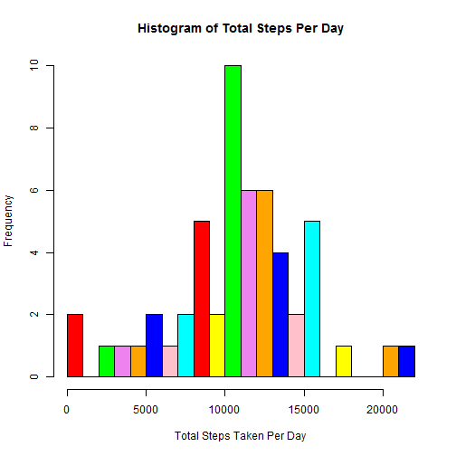
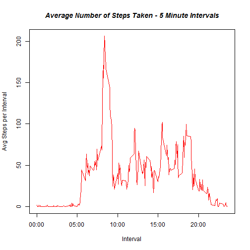
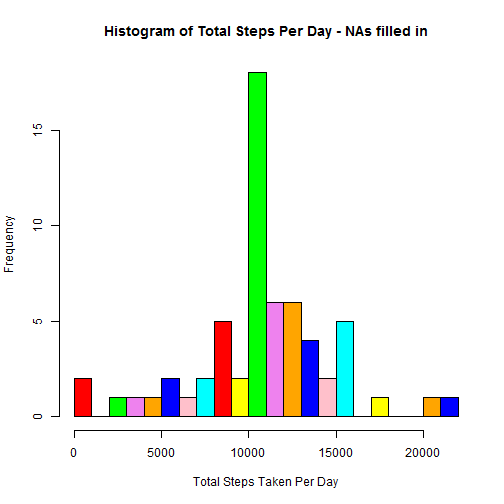
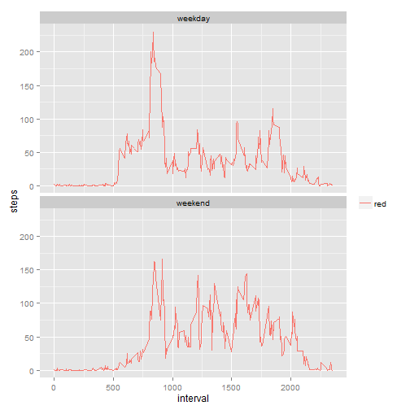

## Loading and preprocessing the data

I have downloaded and unzipped the data file, so set the working directory, and load ggplot2:


```r
setwd("E:/MyStuff/Myfiles/Coursera/5_ReproResearch/Peer_1")
library(ggplot2)
```

Read the CSV file.


```r
## load into dataframe
dfACT <- read.csv("activity.csv", stringsAsFactors = FALSE)
```

## What is mean total number of steps taken per day?

Sum all steps by date, ignoring NA values


```r
dfACTTotal  <- aggregate( steps ~ date, data = dfACT, FUN = sum, na.rm=TRUE)
```


Plot a histogram; I tried different 'breaks' values, and liked 20.


```r
colors <- c("red", "yellow", "green", "violet", "orange", "blue", "pink", "cyan")
hist(dfACTTotal$steps,
     right = FALSE,
     breaks = 20,
     col = colors,
     main = "Histogram of Total Steps Per Day",
     xlab = "Total Steps Taken Per Day")
```

 


Calculate and report the Mean and Median.  First sum all steps by date, then take the mean
and the median.


```r
TotalDailySteps <- as.numeric(tapply(dfACT$steps, dfACT$date, sum))
steps.mean <- mean(TotalDailySteps, na.rm = TRUE)
steps.median <- median(TotalDailySteps, na.rm = TRUE)
```

The mean is:

```r
steps.mean
```

```
## [1] 10766.19
```

The median is:

```r
steps.median
```

```
## [1] 10765
```

## What is the average daily activity pattern?

Calculate the Mean of steps for each interval for non-NAs. 
(we will also use this for line plot and also to fill in for NA values later)

and plot..,


```r
dfACTIntervalMean  <- aggregate( steps ~ interval, data = dfACT, FUN = mean, na.rm=TRUE)
plot(dfACTIntervalMean$interval, dfACTIntervalMean$steps, 
     type="l", xlab = "Interval", ylab = "Avg Steps per Interval", 
     col="red", xaxt = "n" )
labels <- c("00:00", "05:00", "10:00", "15:00", "20:00")
at <-seq(from = 0, to = max(dfACTIntervalMean$interval), by = 500)
axis(side = 1, at = at, labels = labels)
title(main="Average Number of Steps Taken - 5 Minute Intervals", col.main="black", font.main=4)
```

 

Which interval has the max steps?

Get index...


```r
maxStepsIndex <- which.max(dfACTIntervalMean$steps)
maxStepsIndex
```

```
## [1] 104
```

Get interval value for this index...


```r
maxStepsInterval <- dfACTIntervalMean[maxStepsIndex, 1]
maxStepsInterval
```

```
## [1] 835
```

The maximum average steps takes place at 0835 hours.


## Imputing missing values

I tried this two different ways, as I wasn't sure which was the best:

1)  Compute number of NA rows


```r
numNARows <- NROW(dfACT) - NROW(na.omit(dfACT))
numNARows
```

```
## [1] 2304
```


2)  Number of rows where steps = NA

```r
numNASteps <- length(which(is.na(dfACT$steps)))
numNASteps
```

```
## [1] 2304
```

We see that there are 2,304 NA rows.


I will use the values in dfACTIntervalMean (which are for non-NA rows only)
to populate (matching on Interval#) the rows in dfACTnoNAs where 'step' is NA.

First make copy of dfACT for filling in the NAs.


```r
dfACTnoNAs <- dfACT
```

Now loop thru and update


```r
for (i in 1:NROW(dfACTIntervalMean))
{
  # get Interval and Step from dfACTIntervalMean
  thisInterval <- dfACTIntervalMean[i, 1]
  thisStep <- dfACTIntervalMean[i, 2]
  
  # fill in dfACTnoNAs, matching on interval, where steps is NA.  So, all interval = 0
  # will have the same value, etc., instead of NA
  dfACTnoNAs$steps[is.na(dfACTnoNAs$steps) == TRUE & dfACTnoNAs$interval == thisInterval] <- thisStep
}
```

Verify that all NA rows are gone


```r
NROW(subset(dfACTnoNAs, is.na(steps)))
```

```
## [1] 0
```


We will sum on our new data and plot this histogram once more:


```r
# Sum all steps per day
dfACTTotalNoNAs  <- aggregate(steps ~ date, data = dfACTnoNAs , FUN = sum)

## Display histogram for Total Steps per Day
colors <- c("red", "yellow", "green", "violet", "orange", "blue", "pink", "cyan")
hist(dfACTTotalNoNAs$steps,
     right = FALSE,
     breaks = 20,
     col = colors,
     main = "Histogram of Total Steps Per Day - NAs filled in",
     xlab = "Total Steps Taken Per Day")
```

 

We see that the 10,000 to 11,000 steps occurrences have increased quite a bit.

And, we will re-calculate and report the Mean and Median.  First sum all steps by date, then take the mean and the median, as before but on dfACTnoNAs.


```r
TotalDailySteps <- as.numeric(tapply(dfACTnoNAs$steps, dfACT$date, sum))
steps.mean <- mean(TotalDailySteps, na.rm = TRUE)
steps.median <- median(TotalDailySteps, na.rm = TRUE)
```

The mean is:

```r
steps.mean
```

```
## [1] 10766.19
```

The median is:

```r
steps.median
```

```
## [1] 10766.19
```

We see that mean and median are now the same, and that with the strategy used for filling in NAs 
there is essentially no difference from the prior results when NAs were excluded.

## Are there differences in activity patterns between weekdays and weekends?

First, make a new column 'dayType', weekday or weekend.  The following code does this
by taking the date column, converting to a true Date, and returning wday as 0-6.  But since
our character vector is 1-7, we need to add 1.  The computed value 'subsets' out weekend or weekday.

Then, we convert this new column to a factor.  It will then have 2 levels, which will make aggregate work correctly.


```r
dfACTnoNAs$dayType <- c("weekend", "weekday", "weekday", "weekday", "weekday", "weekday", "weekend")[as.POSIXlt(dfACTnoNAs$date)$wday + 1]
dfACTnoNAs$dayType <- as.factor(dfACTnoNAs$dayType)
```

Now calculate the mean steps per interval and dayType, and plot.


```r
dfACTIntervalMeanNoNAs <- aggregate(steps ~ interval+dayType, data = dfACTnoNAs, FUN = mean)
ggplot() +
    facet_wrap(~dayType, nrow = 2, ncol = 1) +
    geom_line(data = dfACTIntervalMeanNoNAs, aes(x = interval, y = steps, color = "red")) +
    theme(legend.title=element_blank())
```

 

It seems like the morning hours for weekends compared to weekdays is still the busiest, but weekends have a bit more activity throughout the day.

## END
